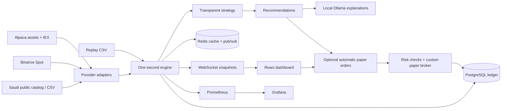

# Architecture

## Deployment unit and concurrency

The monorepo separates code responsibilities, but the API and engine deliberately share one Python process for a manageable first reference. It must run at one replica and one Uvicorn worker. Both manual and automatic fills hold the engine's async mutation lock; the broker also locks wallet rows in PostgreSQL and commits each order atomically. SQLite is only a convenience for local tests/development, not evidence of PostgreSQL concurrency testing.

Provider streams, catalog refresh, the engine and Redis publisher are independent background tasks. A Redis outage cannot block the engine. Market histories are bounded to 20 observations per symbol; each quote retains source timestamp and receipt time. Duplicate/out-of-order events are ignored. Stream backpressure is bounded by the WebSocket client's defaults; client dashboards receive snapshots rather than a backlog of all market events. Slow UI clients disconnect and reconnect.

## Data model

- `assets`: normalized market/symbol ID, name, quote currency, source and active status.
- `watchlist`: persisted selection and priority order.
- `wallets`: mode/market/currency, cash, initial capital and realized P&L.
- `positions`: quantity and fee-inclusive average cost.
- `trades`: immutable local fill records keyed by client idempotency ID.
- `decisions`: changes in signal plus at most one retained sample per minute per watched asset; seven-day retention.
- `controls`: persistent kill-switch and automatic-paper-trading settings.

Prices/rolling windows and the replay cursor are in memory. Redis provides expiring quote caches, engine heartbeat and decision publication. PostgreSQL is the source of truth for durable account state. Repeated orders with the same key/payload return their existing fill; different payloads with the same key are rejected.

## Signal and AI separation

The strategy compares the last five distinct observations with the last twenty. A difference greater than 0.2% yields BUY or SELL; warm-up, stale observations and neutral differences yield HOLD. These are observation windows, not time bars. Every watched asset is evaluated each internal tick, but historical points are only added for new events.

Automatic trading is a deterministic consumer of these signals. It attempts at most one 100-quote-unit order per watched asset per minute. Sells are bounded to current positions. The paper broker retains final authority, including the kill switch and all risk checks. The AI endpoint sends a small signal/price JSON payload to local Ollama, limits output length and handles model errors with an explicit fallback. It has no tools, account authority or execution path.

## Local access

Compose publishes only the UI and observability UIs, all bound to 127.0.0.1. Market providers are outbound data connections; no application is hosted externally. The UI sends the local bearer token in HTTP headers or the initial WebSocket frame; it never appears in a URL. Cross-origin mutation requests and WebSocket origins are rejected. Nginx adds a restrictive content policy. The dashboard stores the token only in the current browser session.

The development default has an empty token to permit an entirely local demo; use the generated `.env` for normal runs. PostgreSQL, Redis and Ollama do not expose host ports. Kubernetes services are ClusterIP; use localhost port forwarding. This is a single-user trusted-local lab, not a public multi-tenant service.

## Extension points for the later rebuild

1. Add Alembic migrations before evolving a persistent schema.
2. Separate engine/API only after introducing leader election and a durable event protocol.
3. Add historical bar ingestion and event-time backtests with corporate actions.
4. Add more realistic liquidity/fill models without introducing real execution.
5. Add daily drawdown limits, portfolio valuation FX and trading calendars explicitly.
6. Test PostgreSQL failover and multi-process locking before changing the replica count.
